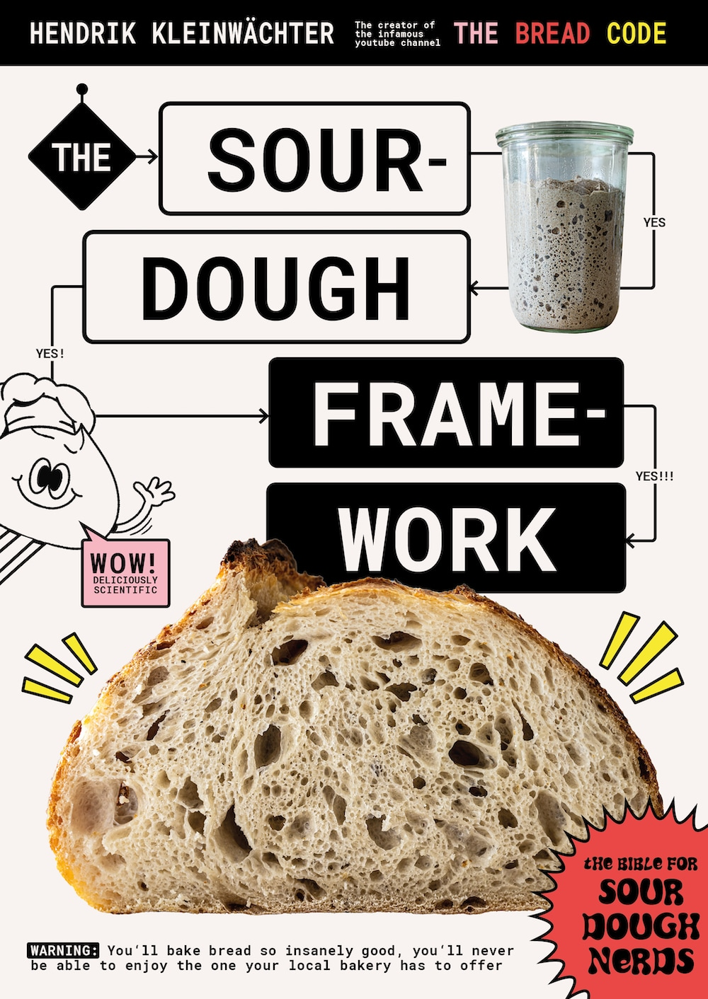
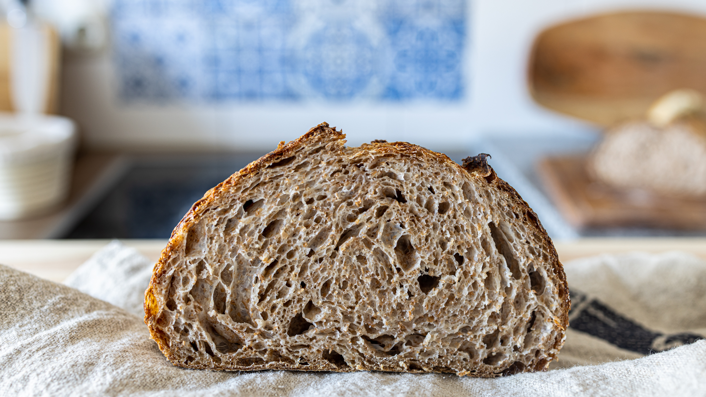

# The Sourdough Framework

The sourdough framework is an open-source book dedicated to
helping you to make the best possible sourdough bread at home.



Rather than providing recipes this book intends to provide a
framework that enables you to bake bread in your respective
environment. Every flour, every sourdough, and every home setup
is different. This makes following recipes without background
information so hard and a fail-prone endeavor. This book
intends to close that gap.

## Background

4 years after launching the repositories [the-bread-code](https://github.com/hendricius/the-bread-code)
and [pizza-dough](https://github.com/hendricius/pizza-dough) I
created this project to merge the knowledge together. This
project intends to go one step deeper into the workings of
natural fermentation. At the same time as many scientific references
as possible are provided.




## 🍞 Baking the book (Docker)

```console
make
```

Then you can check out the file `book/book.pdf`

If you want to 🍞 bake all the versions including ebook variants (.pdf, .epub
in colour and size optimized Black&White), run:

```console
make bake
```

You can check the files in  the folder `book/release/`

## 🍞 Baking the book locally (LaTeX)

Make sure you have `biber`, `latexmk` and ``ImageMagick`` installed. Refer to
your system's installation instructions for LaTeX. To create the serif .pdf
format, run:

```console
cd book/
make
```

If you want to 🍞 bake all the versions including ebook variants (.pdf, .epub
in colour and size optimized Black&White), run:

```console
cd book/
make -j bake
```

You can check the files in the folder `book/release/`

You can get some help on building various versions with:

```console
cd book/
make help
```
## Compiled versions

The below versions are automatically built on every push to the `main` branch.

* [Download compiled .pdf version](https://www.the-bread-code.io/book.pdf)
* [Download compiled .epub version](https://www.the-bread-code.io/book.epub)

There's an additional enhanced accessibility version using a sans-serif font:

* [Download compiled sans-serif .pdf version](https://www.the-bread-code.io/book-sans-serif.pdf)

An additional black and white ebook is provided with a greatly reduced file
size. This shrinks the book from more than 50MB down to ~5MB:

* [Download compiled B&W .epub version](https://www.the-bread-code.io/bw-book.epub)

If you prefer a very short version (about 10 pages) with main flowcharts and
crucial informations needed while you are in the kitchen, we also provide a
"too long;didn't read" version you could print.  Having read the full book is
highly recommended to understand this leaflet:

* [Download a condensed version](https://www.the-bread-code.io/booklet.pdf)

## Online HTML version

Head over to [https://www.the-sourdough-framework.com](https://www.the-sourdough-framework.com)

To build the website make sure to have the ruby version installed specified in
`website/.ruby-version`.

```console
cd book/
make website
```

Alternatively you can build the website directly with Docker:

```console
make website
```

## Hardcover version

There is a hardcover version of the book available for purchase. [You can
read more details here.](https://breadco.de/physical-book)

## Support

Did you find a typo, or feel the wording could be improved?
Feel free to open up a pull request at any time.

I believe that the knowledge this book provides is essential to everyone.
That's why I decided to open source my knowledge hoping
that it will reach more people all over the world without
budget constraints.

If you would like to contribute with a small donation you can do so
via my [ko-fi page.](https://breadco.de/book) Your donation will tremendously
help me to cover costs related to running the-bread-code. It furthermore allows
me to dedicate time to continuously update and improve this book.

## Links

* [My YouTube channel](https://youtube.com/c/thebreadcode)
* [Ask a question on Discord](https://breadco.de/discord)

## License

This work is licensed under a [Creative Commons Attribution-ShareAlike 4.0
International License][cc-by-sa].

[![CC BY-SA 4.0][cc-by-sa-image]][cc-by-sa]

[cc-by-sa]: http://creativecommons.org/licenses/by-sa/4.0/
[cc-by-sa-image]: https://licensebuttons.net/l/by-sa/4.0/88x31.png
[cc-by-sa-shield]: https://img.shields.io/badge/License-CC%20BY--SA%204.0-lightgrey.svg
