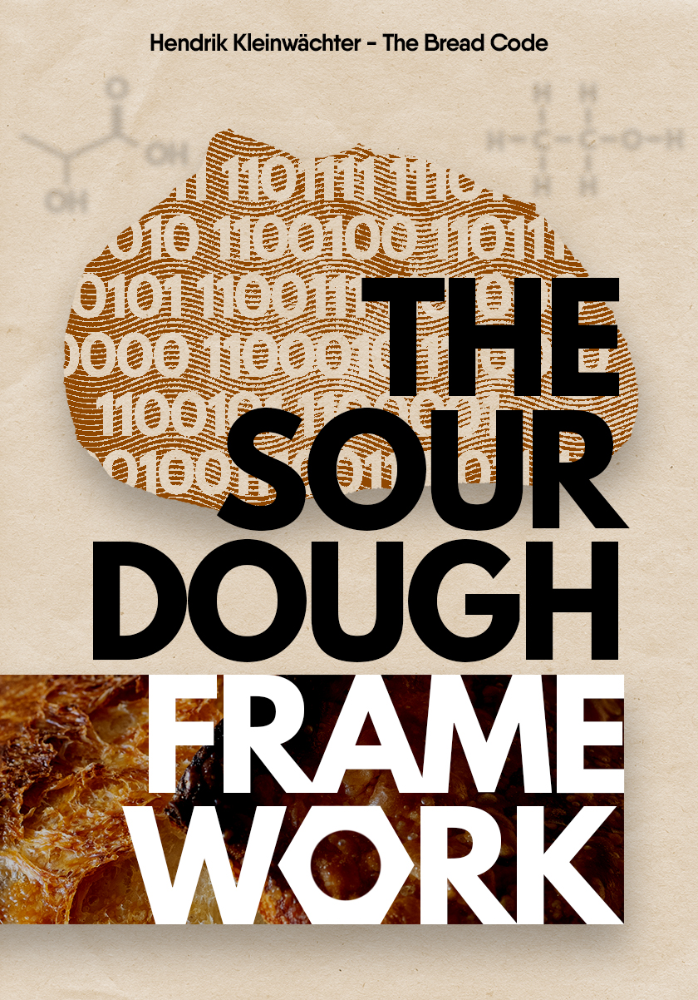

# The Sourdough Framework

The sourdough framework is an open-source book dedicated to
helping you to make the best possible sourdough bread at home.



Rather than providing recipes this book intends to provide a
framework that enables you to bake bread in your respective
environment. Every flour, every sourdough, and every home setup
is different. This makes following recipes without background
information so hard and a fail-prone endeavor. This book
intends to close that gap.

## Background

4 years after launching the repositories [the-bread-code](https://github.com/hendricius/the-bread-code)
and [pizza-dough](https://github.com/hendricius/pizza-dough) I
created this project to merge the knowledge together. This
project intends to go one step deeper into the workings of
natural fermentation. At the same time as many scientific references
as possible are provided.


## Building the book (Docker)

```console
make
```

Then you can check out the file `book/book.pdf`

If you want to build the eBook versions (.epub, .mobi, .azw3) run:

```console
make release
```

You can check the files in  the folder `book/release/`

## Building the book locally (LaTeX)

Make sure you have `biber` installed. Refer to your system's installation
instructions for LaTeX.

```console
cd book/
make
```

If you want to build the eBook versions (.epub, .mobi, .azw3) run:

```console
cd book/
make release
```

You can check the files in the folder `book/release/`

## Compiled versions

The below versions are automatically built on every push to the `main` branch.

* [Download compiled .pdf version](https://www.the-bread-code.io/book.pdf)
* [Download compiled .epub version](https://www.the-bread-code.io/book.epub)
* [Download compiled .mobi version](https://www.the-bread-code.io/book.mobi)
* [Download compiled .azw3 version](https://www.the-bread-code.io/book.azw3)

There's an additional enhanced accessibility version using a sans serif font:

* [Download compiled .pdf version](https://www.the-bread-code.io/book-sans-serif.pdf)
* [Download compiled .epub version](https://www.the-bread-code.io/book-sans-serif.epub)
* [Download compiled .mobi version](https://www.the-bread-code.io/book-sans-serif.mobi)
* [Download compiled .azw3 version](https://www.the-bread-code.io/book-sans-serif.azw3)

## Support

Did you find a typo, or feel the wording could be improved?
Feel free to open up a pull request at any time.

I believe that the knowledge this book provides is essential to everyone.
That's why I decided to open source my knowledge hoping
that it will reach more people all over the world without
budget constraints.

If you would like to contribute with a small donation you can do so
via my [ko-fi page.](https://breadco.de/book) Your donation will tremendously
help me to cover costs related to running the-bread-code. It futhermore allows
me to dedidcate time to continously update and improve this book.

## Links

* [My YouTube channel](https://youtube.com/c/thebreadcode)
* [Ask a question on Discord](https://breadco.de/discord)
