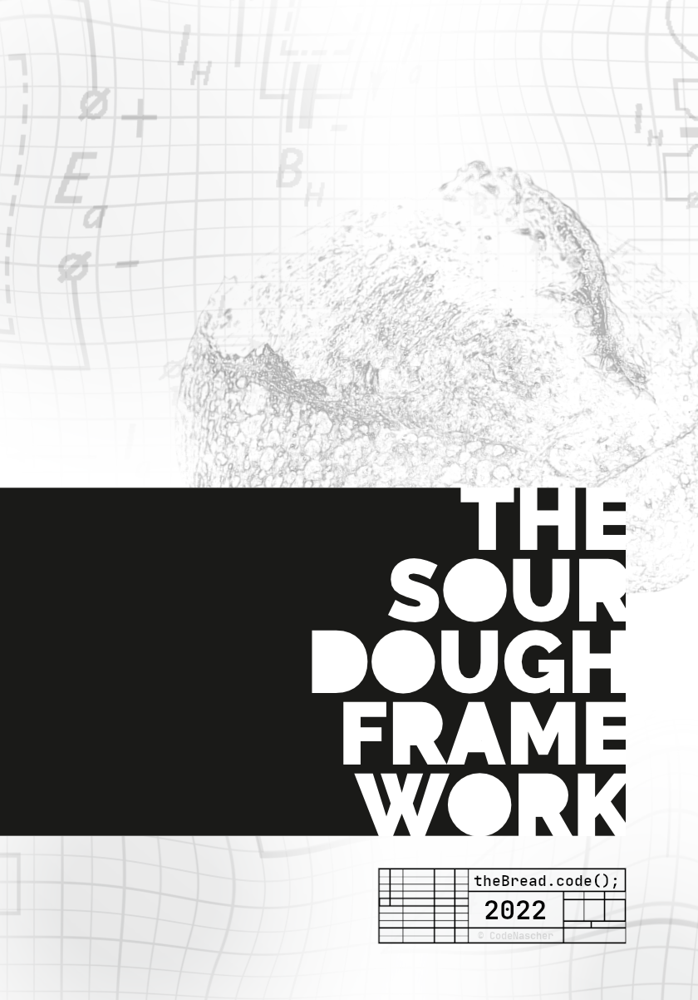
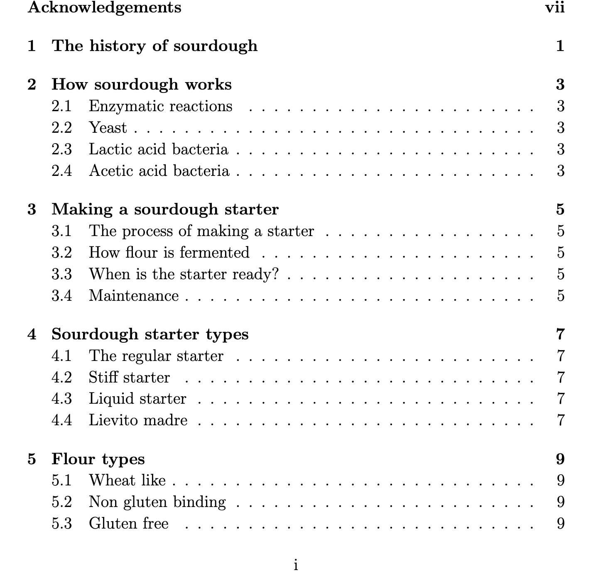

# The Sourdough Framework

4 years later after launching [the-bread-code repo](https://github.com/hendricius/the-bread-code) repo and the [pizza-dough repo](https://github.com/hendricius/pizza-dough) I present to you The Sourdough Framework. TSF will be a completely free community driven open source ebook on making
sourdough bread. My dream is to enable everyone around the world to have the tools
at hand to bake fresh bread. Rather than providing recipes this book intends to provide a framework that enables you to bake bread in your individual environment. Every flour, every sourdough and every home setup is different. This makes making sourdough bread at home so hard. Say no more, this book will help you to master making bread in your environment.

I believe in open source and that's why this book will also be open source. I plan to make a hardcover version, but the digital version will always be free. You can help me make my dream reality by [funding my Ko-Fi campaign](https://ko-fi.com/thebreadcode) to write the first part of the book. If the first part is a success, then I will be asking the community to decide on the next chapters. Another campaign will follow. This way we can shape the future of this book together.

I will use the money to take time off from my job. Furthermore as I am not a native speaker I will try to find some help with improving the text. Additionally I need to use some of the money to pay a layouter for the book from the community.

I imagine the following chapters as a start (TBD):

You can follow the progress in the `book/` folder

